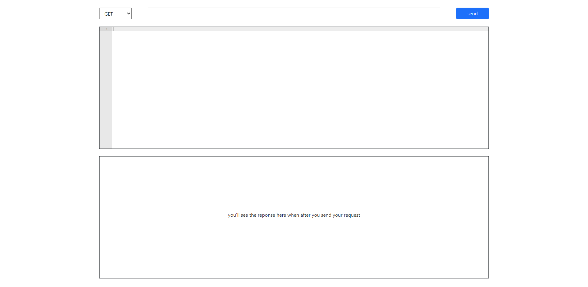

# React - REST Client

## Description
This is a really simple REST Client made using react and bootstrap. you can make basic api call and include a body to your request.



## Usage

```
# Install Dependencies
npm install

# Start locally
npm start

# Build
npm run build
```

## License

MIT
